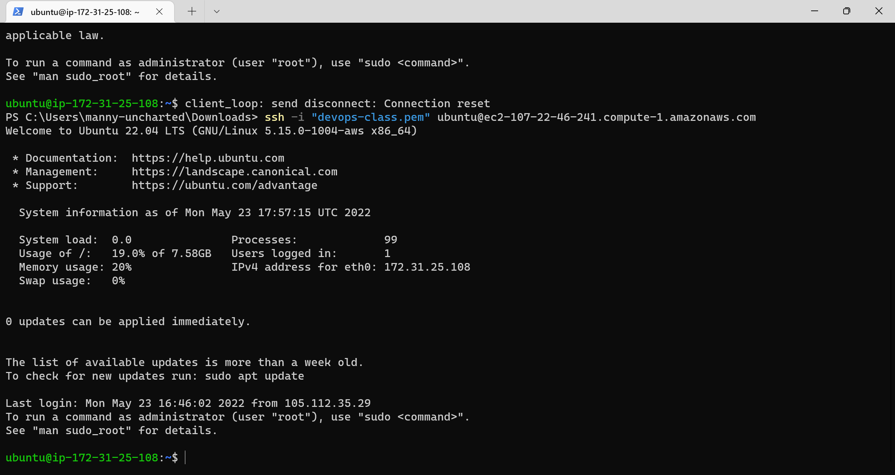
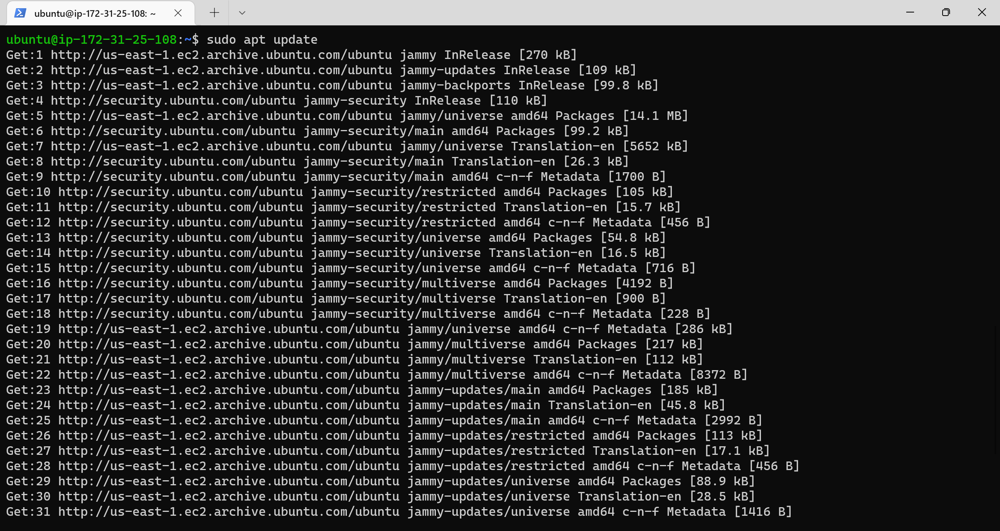
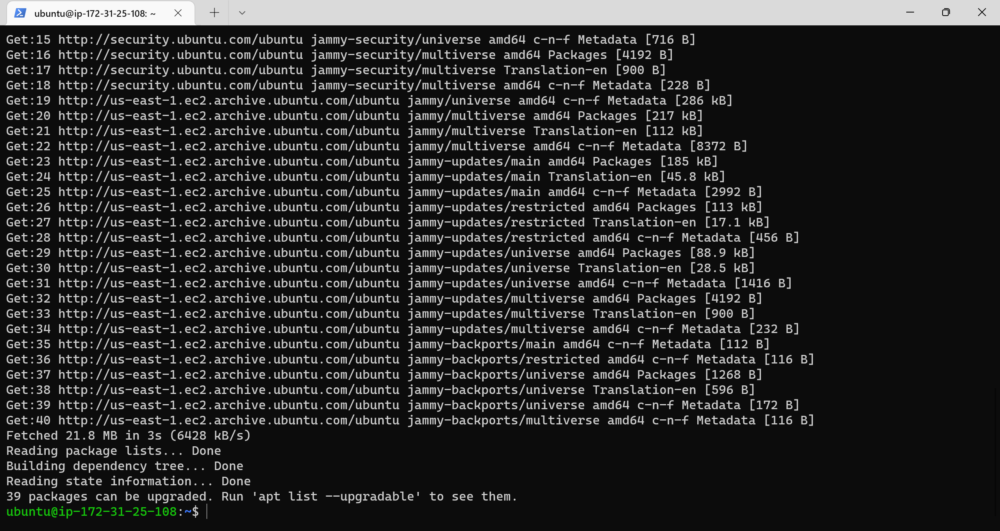
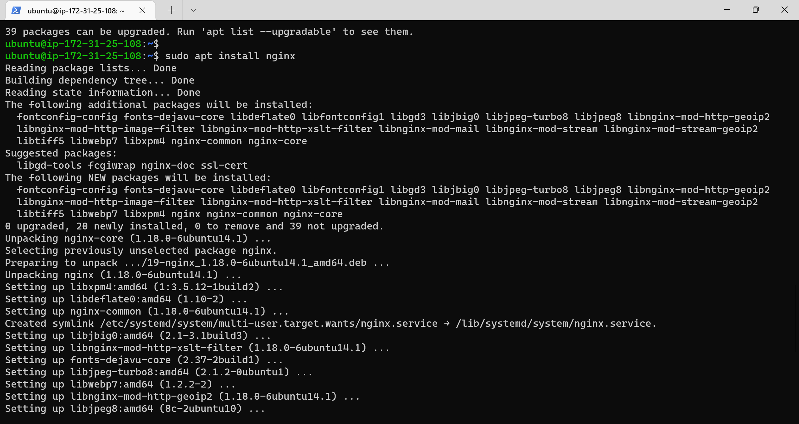
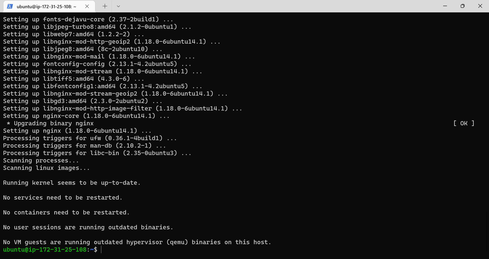
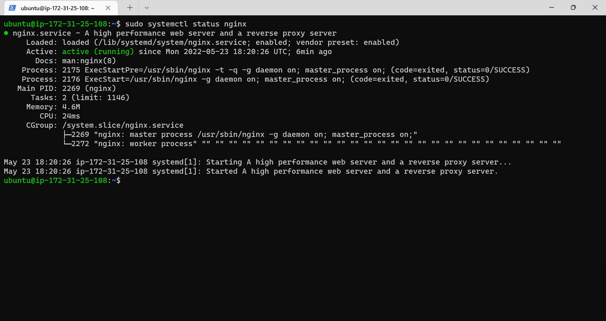

## Implementation of the LEMP STACK

In this project we would work on the following components of the LEMP stack:

- connecting to the ec2 instance.
- Installing the nginx web server.
- Installing the MySQL database.
- configuring nginx to use php processor.
- testing php with nginx.
- retrieving data from mysql database with php.

### connecting to the ec2 instance
Here we would have to connect to the EC2 instance we created on AWS.

    ```
    ssh -i "devops-class.pem" ubuntu@ec2-107-22-46-241.compute-1.amazonaws.com
    ```

Results:
    


### Installing the nginx web server
Here we have to set up the nginx web server.

- update the linux server with the latest version of the software.
    ```
    sudo apt update
    ```

    Results:
    

    

- Getting Nginx installed on our instance
    ```
    sudo apt install nginx
    ```

    Results:
    

    
    
    When prompted, enter Y to confirm that you want to install Nginx. Once the installation is finished, the Nginx web server will be active and running on your Ubuntu 20.04 server.

- Verifying that nginx is installed on the instance and is running as a service.
    ```
    sudo systemctl status nginx
    ```

    Results:
    
