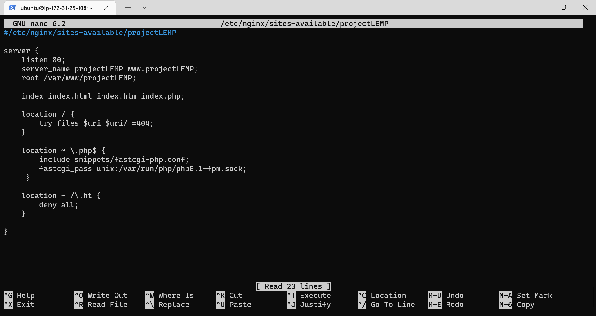
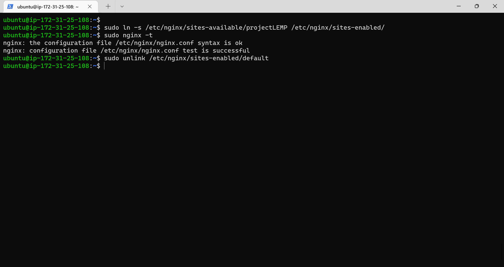

## Implementation of the LEMP STACK

In this project we would work on the following components of the LEMP stack:

- connecting to the ec2 instance.
- Installing the nginx web server.
- Installing the MySQL database.
- configuring nginx to use php processor.
- testing php with nginx.
- retrieving data from mysql database with php.

### connecting to the ec2 instance
Here we would have to connect to the EC2 instance we created on AWS.

    ```
    ssh -i "devops-class.pem" ubuntu@ec2-107-22-46-241.compute-1.amazonaws.com
    ```

Results:
    


### Installing the nginx web server
Here we have to set up the nginx web server.

- update the linux server with the latest version of the software.
    ```
    sudo apt update
    ```

    Results:
    

    

- Getting Nginx installed on our instance
    ```
    sudo apt install nginx
    ```

    Results:
    

    
    
    When prompted, enter Y to confirm that you want to install Nginx. Once the installation is finished, the Nginx web server will be active and running on your Ubuntu 20.04 server.

- Verifying that nginx is installed on the instance and is running as a service.
    ```
    sudo systemctl status nginx
    ```

    Results:
    

    Our server is running and we can access it locally and from the Internet

- checking how we can access it locally in our Ubuntu shell.
    ```
    curl http://localhost:80
    ```

    Results:
    

- retrieving our ip address:
    ```
    curl -s http://169.254.169.254/latest/meta-data/public-ipv4
    ```

    Results:
    

- Now it is time for us to test how our Nginx server can respond to requests from the Internet.

    Open a web browser of your choice and try to access following url
    ```
    http://<your-ip-address>:80
    ```

    Results:
    

### Installing the MySQL database
MySQL is a popular relational database management system used within PHP environments, so we will use it in our project. As we would need you need a Database Management System (DBMS) to be able to store and manage data for your site in a relational database. 

- Installing the MySQL server.
    ```
    sudo apt install mysql-server
    ```

    Results:
    

    

    When prompted, enter Y to confirm that you want to install MySQL. Once the installation is finished, the MySQL server will be active and running on your Ubuntu 20.04 server.

- When the installation is finished, log in to the MySQL console by typing.
    ```
    sudo mysql
    ```

    Results:
    

- altering the root password of mysql login.
    ```
    ALTER USER 'root'@'localhost' IDENTIFIED BY '<your-password>';
    ```

    Results:
    

    and then exit with the command
    ```
    exit
    ```

- starting the interactive script using the command
    ```
    sudo mysql_secure_installation
    ```
    This will ask if you want to configure the VALIDATE PASSWORD PLUGIN.

    Results:
    

- When you’re finished, to test if you’re able to log in to the MySQL console by typing.
    ```
    sudo mysql -p
    ```

    Results:
    

    Notice the -p flag in this command, which will prompt you for the password used after changing the root user password.

    To exit the MySQL console,
    ```
    exit
    ```
    Your MySQL server is now installed and secured. Next, we will install PHP, the final component in the LEMP stack.


### Installing PHP on our AWS Instance.
PHP is a popular general-purpose scripting language that is especially suited to web development. It is a widely-used, free, and efficient alternative to Microsoft's ASP.NET and Java servlets.

While Apache embeds the PHP interpreter in each request, Nginx requires an external program to handle PHP processing and act as a bridge between the PHP interpreter itself and the web server. 

This allows for a better overall performance in most PHP-based websites, but it requires additional configuration. we’ll need to install php-fpm, which stands for “PHP fastCGI process manager”, and tell Nginx to pass PHP requests to this software for processing. Additionally, we’ll need php-mysql, a PHP module that allows PHP to communicate with MySQL-based databases. Core PHP packages will automatically be installed as dependencies.

- To install these 2 packages at once, run:
    ```
    sudo apt install php-fpm php-mysql
    ```

    Results:
    

    When prompted, enter Y to confirm that you want to install PHP. Once the installation is finished, the PHP server will be active and running on our AWS EC2 Instance.


### Configuring Nginx to Use PHP Processor.
When using the Nginx web server, we can create server blocks (similar to virtual hosts in Apache) to encapsulate configuration details and host more than one domain on a single server. In this guide, we will use projectLEMP as an example domain name.

On Ubuntu 20.04, Nginx has one server block enabled by default and is configured to serve documents out of a directory at /var/www/html. While this works well for a single site, it can become difficult to manage if you are hosting multiple sites. 

Instead of modifying /var/www/html, we’ll create a directory structure within /var/www for the your_domain website, leaving /var/www/html in place as the default directory to be served if a client request does not match any other sites.

- Creating the root web directory for your_domain as follows.
    ```
    sudo mkdir /var/www/projectLEMP
    ```

    Results:
    


- Next, assign ownership of the directory with the $USER environment variable, which will reference your current system user.
    ```
    sudo chown -R $USER:$USER /var/www/projectLEMP
    ```

    Results:
    

- Then, open a new configuration file in Nginx’s sites-available directory using your preferred command-line editor. Here, we’ll use nano.
    ```
    sudo nano /etc/nginx/sites-available/projectLEMP
    ```
    this will create a new file, then paste the following line of code.

    ```
    #/etc/nginx/sites-available/projectLEMP

    server {
        listen 80;
        server_name projectLEMP www.projectLEMP;
        root /var/www/projectLEMP;

        index index.html index.htm index.php;

        location / {
            try_files $uri $uri/ =404;
        }

        location ~ \.php$ {
            include snippets/fastcgi-php.conf;
            fastcgi_pass unix:/var/run/php/php8.1-fpm.sock;
        }

        location ~ /\.ht {
            deny all;
        }

    }
    ```

    Here’s what each of these directives and location blocks do:

    - listen — Defines what port Nginx will listen on. In this case, it will listen on port 80, the default port for HTTP.

    - root — Defines the document root where the files served by this website are stored.

    - index — Defines in which order Nginx will prioritize index files for this website. It is a common practice to list index.html files with a higher precedence than index.php files to allow for quickly setting up a maintenance landing page in PHP applications. You can adjust these settings to better suit your application needs.

    - server_name — Defines which domain names and/or IP addresses this server block should respond for. Point this directive to your server’s domain name or public IP address.

    - location / — The first location block includes a try_files directive, which checks for the existence of files or directories matching a URI request. If Nginx cannot find the appropriate resource, it will return a 404 error.

    - location ~ \.php$ — This location block handles the actual PHP processing by pointing Nginx to the fastcgi-php.conf configuration file and the php7.4-fpm.sock file, which declares what socket is associated with php-fpm.

    location ~ /\.ht — The last location block deals with .htaccess files, which Nginx does not process. By adding the deny all directive, if any .htaccess files happen to find their way into the document root ,they will not be served to visitors.

    When you’re done editing, save and close the file. If you’re using nano, you can do so by typing CTRL+X and then y and ENTER to confirm.

    Results:
    

- Activate your configuration by linking to the config file from Nginx’s sites-enabled directory.
    ```
    sudo ln -s /etc/nginx/sites-available/projectLEMP /etc/nginx/sites-enabled/
    ```

    Results:
    

- This will tell Nginx to use the configuration next time it is reloaded. You can test your configuration for syntax errors by typing.
    ```
    sudo nginx -t
    ```

    Results:
    

- We also need to disable default Nginx host that is currently configured to listen on port 80, for this run.
    ```
    sudo unlink /etc/nginx/sites-enabled/default
    ```

    Results:
    

- When you are ready, reload Nginx to apply the changes
    ```
    sudo systemctl reload nginx
    ```

    Results:
    

    Your new website is now active, but the web root /var/www/projectLEMP is still empty.

- Create an index.html file in that location so that we can test that your new server block works as expected
    ```
    sudo echo 'Hello LEMP from hostname' $(curl -s http://169.254.169.254/latest/meta-data/public-hostname) 'with public IP' $(curl -s http://169.254.169.254/latest/meta-data/public-ipv4) > /var/www/projectLEMP/index.html
    ```

    Results:
    

- Now go to your browser and try to open your website URL using IP address.
    ```
    http://<Public-IP-Address>:80
    ```

    Results:
    

    Your LEMP stack is now fully configured. In the next step, we’ll create a PHP script to test that Nginx is in fact able to handle .php files within your newly configured website.


### Testing PHP with Nginx

Your LEMP stack should now be completely set up.
At this point, your LEMP stack is completely installed and fully operational.
You can test it to validate that Nginx can correctly hand .php files off to your PHP processor.

- Create a PHP script in the root of your web root directory.
    ```
    sudo nano /var/www/projectLEMP/info.php
    ```
    Paste the following code.

    ```
    <?php
    phpinfo();
    ?>
    ```

    Results:
    

- You can now access this page in your web browser by visiting the domain name or public IP address you’ve set up in your Nginx configuration file, followed by /info.php
    ```
    http://<Public-IP-Address>:80/info.php
    ```

    Results:
    

    You should see the following output:
    

- After checking the relevant information about your PHP server through that page, it’s best to remove the file you created as it contains sensitive information about your PHP environment and your Ubuntu server. You can use rm to remove that file.
    ```
    sudo rm /var/www/your_domain/info.php
    ```

    Results:
    

### Retrieving data from MySQL database with PHP.
The focus of this this step is to create a test database (DB) with simple "To do list" and configure access to it, so the Nginx website would be able to query data from the DB and display it.

We will create a database named example_database and a user named example_user, but you can replace these names with different values.

- We first need to connect to the MySQL console using the root account.
    ```
    sudo mysql
    ```

    Results:
    

- Now we have to create a new database, run the following command from your MySQL console.
    ```
    CREATE DATABASE example_database;
    ```

    Results:
    

- Now we are creating a new user and granting him full privileges on the database that was just created.
    ```
    CREATE USER 'example_user'@'%' IDENTIFIED WITH mysql_native_password BY 'PassWord.1';
    ```

    Results:
    

- Now we need to give this user permission over the example_database database.
    ```
    GRANT ALL PRIVILEGES ON example_database.* TO 'example_user'@'%';
    ```

    Results:
    

    and then exit mysql using the command
    ```
    exit
    ```

- You can test if the new user has the proper permissions by logging in to the MySQL console again, this time using the custom user credentials.
    ```
    mysql -u example_user -p
    ```

    Results:
    

- After logging in to the MySQL console, we need to confirm that we have access to the example_database database.
    ```
    SHOW DATABASES;
    ```

    Results:
    